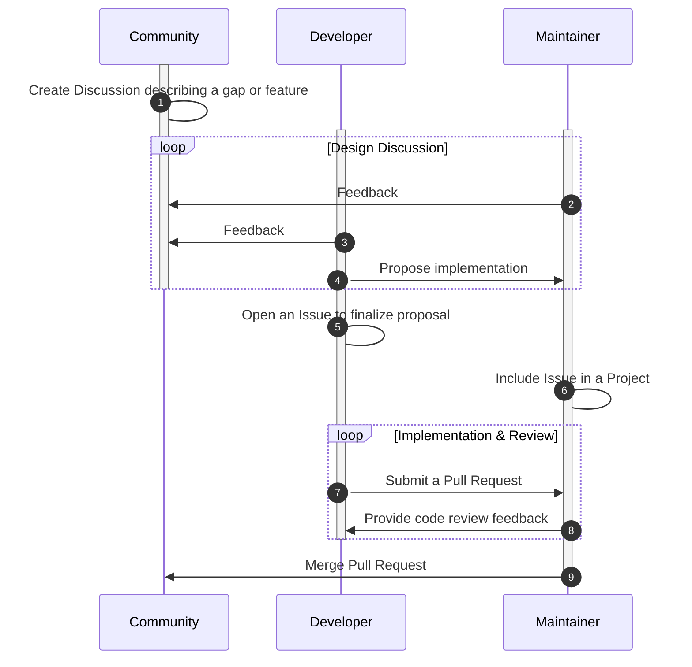

# Contributing to windIO

windIO was started under IEA Wind Task 37 and has been additionally supported by IEA Wind Task 55
as well as other community-based groups, research organization, and private companies.
Being such a collaborative effort, it is important to establish a common understanding of
rules, responsibilities, and expectations from all stakeholders.
This document outlines the processes and guidelines for contributing to windIO.

The windIO repository includes JSON schemas, YAML files that describe wind energy systems
conforming to the schemas, Python code for working with the schemas and input files,
source files for web-based documentation, and various other files that serve as infrastructure.
Changes to anything that is tracked with git in the windIO repository is considered a contribution,
and these guidelines apply.

## Code of Conduct

As members of the wind energy community, we all agree that the advancement of wind
energy technologies is critical for the sustainability of our planet.
This shared goal should be reflected in our interactions with each other.
Remember that we're all on the same team despite our individual day to day stressors and needs.

Two principles should guide our conduct:
- [Think that you might be wrong.](https://en.wikipedia.org/wiki/Cromwell%27s_rule)
- [Assume good faith.](https://en.wikipedia.org/wiki/Wikipedia:Assume_good_faith)

## Git Flow

Contributions are tracked with [git](https://docs.github.com/en/get-started/start-your-journey/about-github-and-git#about-git)
and coordinated with [GitHub](https://github.com).

In general, the [git-flow](https://nvie.com/posts/a-successful-git-branching-model/) model is used
to navigate parallel development efforts.
Here's a brief summary:
- Day to day work happens on feature branches on the principle repository or forks. The feature
    branches may be unstable, and there's no expectation that they are complete.
    These branches should have a simple name that is indicative of the scope of the work.
- The `develop` branch absorbs feature branches when they are complete through pull requests.
    This branch is somewhat stable, but not yet ready to let loose for the general users.
- The `main` branch is the most stable and tested with the lowest frequency of changes.
    It should always represent the "released" version of windIO.

Most often, feature branches are merged into `develop`, and less frequently `develop`
is merged into `main`.
The exception is when fixing a major bug in which case a bug-fix branch is merged directly
into `main`, and then `main` is merged back into `develop`.
The git history should be synced to GitHub frequently, and coordination across
branches should happen there.

<!--
Note that git messages and history are tools for communicating with other roles in the process.
Possibly link to https://nrel.github.io/WETOStack/software_dev/best_practices.html#version-control.
-->

<!-- 
Branches could live on one fork or multiple. Ultimately, it doesn't really matter so long
as the pull request model is followed.
-->

## Roles, Responsibilities and Expectations

The collaborative development process involves various people with distinct roles and 
a single person may participate as multiple roles.
In the context of windIO, the following are identified:
- **Contributor**: Adds to or modifies content in the windIO repository.
- **Reviewer**: Reviews and critiques contributions by **developers**.
- **Maintainer**: Manages the repository by supporting the review process, managing issues,
    and generally ensuring the quality of the repository.

<!-- :title: A representative workflow among all actors in a software development workflow leveraging GitHub features -->
